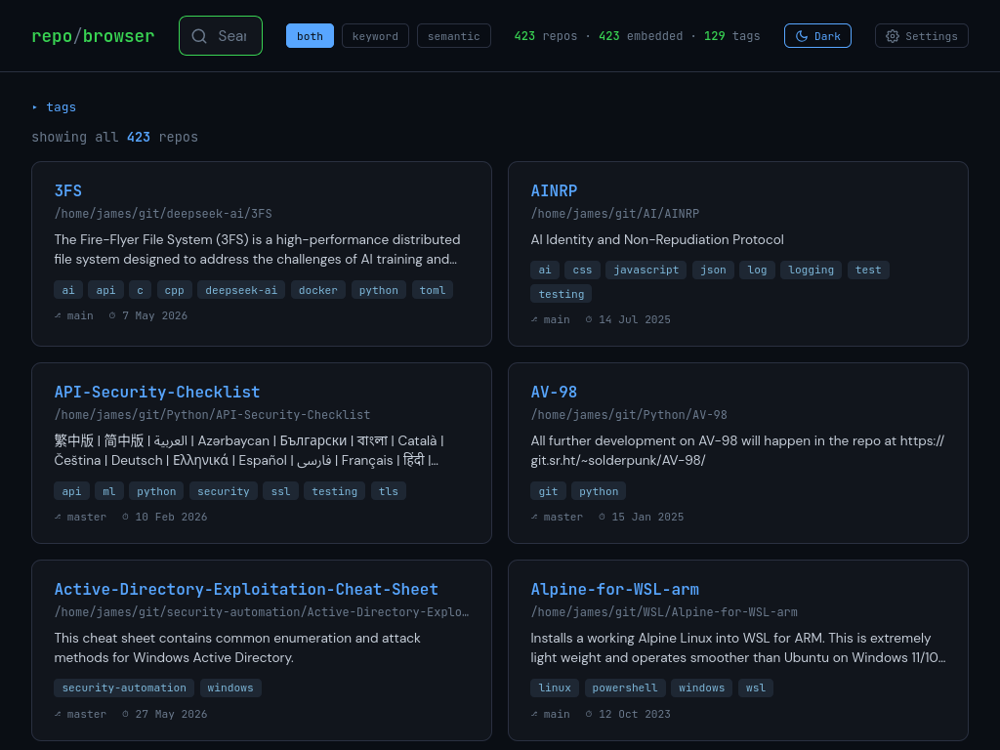
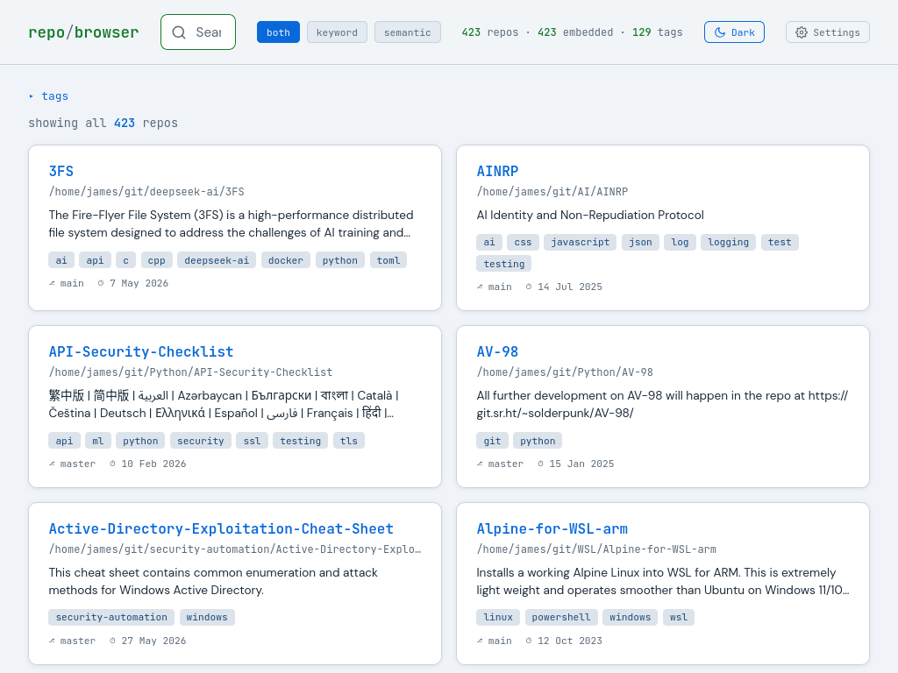

# repo-browser

Local searchable index of all your git repos. Combines FTS5 keyword search with semantic vector search (via Ollama) so you can find repos by name, tag, or plain English description like "something that monitors kubernetes pods".

<details open>
<summary>🌙 Dark mode</summary>



</details>

<details>
<summary>☀️ Light mode</summary>



</details>

---

## Contents

- [Prerequisites](#prerequisites)
- [Installation and Usage](#installation-and-usage)
- [CLI](#cli)
- [Configuration](#configuration)
- [Files](#files)
- [Search](#search)
- [Tag Generation](#tag-generation)
- [Duplicate Detection](#duplicate-detection)
- [Deduplication](#deduplication)

---

## Prerequisites

- Python 3.10+ (stdlib only — no pip installs required)
- Ollama with `nomic-embed-text` — installed automatically on first run if missing

## Platform Support

| Platform | Status |
|---|---|
| Linux | ✅ Fully supported |
| macOS | ✅ Fully supported (Homebrew used for Ollama install) |
| Windows (native) | ❌ Not supported — use WSL (Windows Subsystem for Linux) |

On Windows, install [WSL](https://learn.microsoft.com/en-us/windows/wsl/install) and run repo-browser inside it as you would on Linux.

## Installation and Usage

Clone the repo and add the launcher to your PATH:

```bash
git clone <repo-url> /path/to/repo-browser
cd /path/to/repo-browser

# Option A: symlink the Python launcher into a directory already in your PATH
ln -s "$(pwd)/repo-browser.py" ~/bin/repo-browser.py

# Option B: symlink the shell wrapper (also works, delegates to repo-browser.py)
ln -s "$(pwd)/repo-browser.sh" ~/bin/repo-browser.sh
```

Start the server:

```bash
repo-browser.sh start
```

On first run there is no config yet. The server starts anyway — open http://localhost:8642 and click the gear icon in the top-right corner to set:

- **gitParent** — the root directory containing all your git repos
- **workDir** — the directory where repo-browser files live

Click Save. The UI will show the command to install the config system-wide:

```bash
sudo cp /path/to/repo-browser/rb.config /etc/rb.config
```

Alternatively, copy the example and edit it directly:

```bash
sudo cp rb.config.example /etc/rb.config
sudo vi /etc/rb.config
```

Once the config is in place, scan your repos and generate embeddings:

```bash
repo-browser.sh rescan
```

Refresh the browser. Your repos are now searchable.

## CLI

```bash
repo-browser.py start     # start server on :8642
repo-browser.py stop      # stop server
repo-browser.py restart   # stop + start
repo-browser.py status    # PID, config source, repo/tag/embed counts
repo-browser.py rescan    # re-scan git dir + re-embed (server stays up)
repo-browser.py duplist   # report duplicate clones to ~/Clone-Duplist.txt
```

The `.sh` wrapper is still available and delegates to `repo-browser.py` for backward compatibility.

## Configuration

The config file is read from `/etc/rb.config`. If not found, the script falls back to `rb.config` in its own directory. If neither exists, the server starts with defaults and serves the settings UI so you can create one.

```
# /etc/rb.config
gitParent=/home/user/git
workDir=/home/user/bin/repo-browser
```

`rb.config.example` is the template included in the repo. Your local `rb.config` is gitignored.

## Files

| File | Purpose |
|---|---|
| `repo-browser.py` | Cross-platform launcher — start/stop/restart/status/rescan/duplist |
| `repo-browser.sh` | Thin shell wrapper — delegates to `repo-browser.py` |
| `scan_repos.py` | Walks `gitParent`, extracts metadata, auto-generates tags, deduplicates by remote URL, populates SQLite |
| `embed_repos.py` | Generates semantic embeddings via Ollama `nomic-embed-text` |
| `repo_search.py` | HTTP server on port 8642 — search API + settings API + serves UI |
| `index.html` | Single-page frontend with search, tag cloud, settings modal |
| `find-dupe.py` | Reports duplicate repo clones across category folders |
| `rb_config.py` | Shared config loader used by all scripts |
| `rb.config.example` | Template config (copy to `/etc/rb.config`) |
| `repos.db` | SQLite database (gitignored, regenerated by scan) |

## Search

Three modes (toggle in the UI header):

- **keyword** — FTS5 full-text search across repo name, description, README, and tags
- **semantic** — cosine similarity on `nomic-embed-text` vectors via Ollama. Finds conceptually related repos even without keyword overlap
- **both** (default) — weighted blend: 20% keyword + 30% semantic + 20% name match + 30% tag match

Scoring signals:
- Exact name match gets highest priority
- Substring name match (e.g. "MonVisor" finds "MonVisor-Corpus")
- Tag match (searching "rust" prioritises repos tagged `rust`)
- Semantic-only results are filtered below a 0.65 cosine threshold to reduce noise

## Tag Generation

Tags are auto-generated on scan from multiple sources:

- **File extensions** — `.py`→python, `.go`→golang, `.rs`→rust, `.tf`→terraform, etc.
- **README keywords** — matches against ~80 known infra/tool terms (kubernetes, docker, prometheus, ansible, etc.)
- **Directory category** — parent folder name becomes a tag (e.g. `security-automation/`)
- **Special files** — Dockerfile→docker, Jenkinsfile→jenkins, ansible.cfg→ansible

Tags sourced as `auto` are regenerated on every scan. Manual tags (source `manual`) are preserved across rescans.

## Duplicate Detection

If you organise repos into category folders, the same repo may end up cloned in multiple places. The `duplist` command finds these and writes a report to `~/Clone-Duplist.txt`:

```bash
repo-browser.sh duplist
```

Output example:

```
App Name                     Loc1           Loc2                 Loc3
---------------------------------------------------------------------
bash-textgen                 bash           learning             machine-learning
kubernetes-chatgpt-bot       kubernetes     robusta
WSL-Hello-sudo               WSL            security-automation
```

Locations are directory names under `gitParent`. Duplicates are detected by normalised remote URL, with a fallback to name matching for repos without a remote.

Note: the scanner's `rescan` command also deduplicates automatically — it keeps one copy (the deepest/most specific path) and removes the others from the search index. The `duplist` report shows you what's on disk so you can decide which clones to clean up manually.

## Deduplication

Many repos exist in multiple category folders. The scanner deduplicates by:

1. Normalising remote URLs (`git@` ↔ `https://`, trailing `.git`)
2. Grouping repos with the same URL
3. Keeping the deepest path (most specific category folder)
4. For repos without a remote, deduplicating by name

Stale entries (removed or deduped repos) are cleaned from all tables including FTS5 on every scan.
